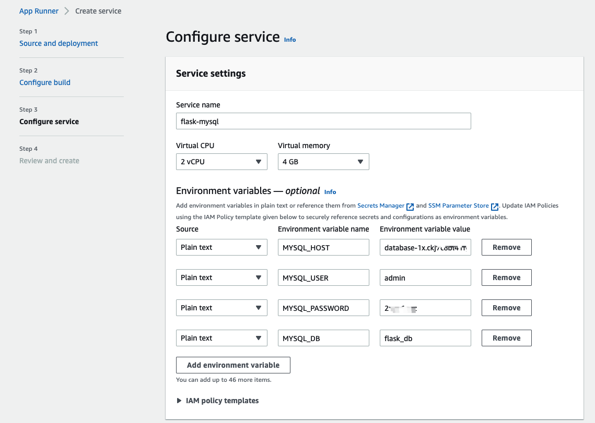
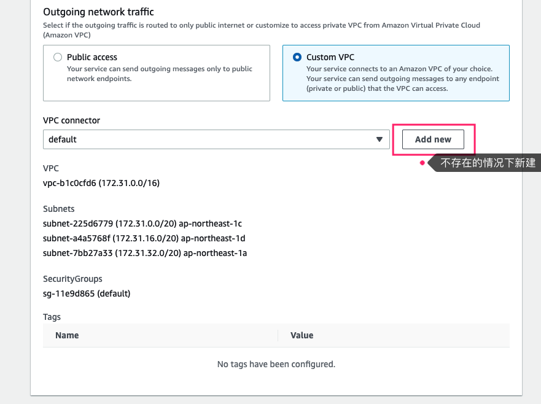

### Sample app for benchmarking python

#### Tech stack
* Amazon Linux 2, 5.10
* Python 3.7.10
* Flask 2.1.3

#### APIs

* `/echo`: simple hello world response

* `/uuid`: generate and return uuid

* `/pi?steps=n`: caclulate Pi based on the specified interations


#### Deployment guide




```shell
sudo yum install git tmux -y
sudo yum install python3-devel mysql-devel
git clone https://github.com/ensean/flask-demo-4-bm.git
cd flask-demo-4-bm
python3 -m venv venv
source venv/bin/activate
pip install -r requirements.txt

tmux
gunicorn -w 9 --bind 0.0.0.0 wsgi:app

```


